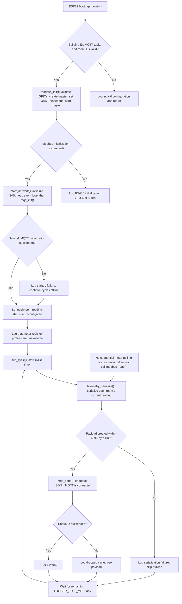

# Firmware execution flow



NVS is erased and initialized again only when `nvs_flash_init()` reports no free
pages or a new NVS version. An empty broker URI is an explicit offline mode and
does not select a substitute broker. ESP-MQTT and the Wi-Fi event handler manage
reconnection after their clients have started.

# Repository layout

| Path | Contents |
| --- | --- |
| `firmware/` | ESP-IDF project of the logger (`water_logger`) |
| `components/` | Logger components: `modbus`, `meter`, `telemetry`, `logger_mqtt` |
| `tools/ddsu666/` | PC app and ESP32 RS485 bridge firmware to read and configure CHINT DDSU666 meters ([README](tools/ddsu666/README.md)) |
| `tools/local-broker/` | Local MQTT broker (Node.js) that receives the logger's messages during tests |
| `references/` | Vendor sample code for the iMaker ESP32 board |
| `dev.bat`, `dev.ps1` | One script for building, flashing and running all of the above |

# Build, flash and run

`dev.bat` drives everything; `dev.bat help` lists every command and option.

```
dev.bat config                 # logger settings: Wi-Fi, MQTT broker, building and room IDs
dev.bat flash -Port COM16      # build and flash the logger, then show its log
dev.bat broker                 # local MQTT broker that receives the logger's messages
dev.bat bridge -Port COM16     # flash the DDSU666 RS485 bridge and open the meter tool
dev.bat test                   # tests of the DDSU666 tool and the broker
```

The script activates ESP-IDF 5.3+ from `C:\Espressif` by itself (`-IdfPath` to point elsewhere) and needs
Python 3 with Tkinter for the meter tool and Node.js 20+ for the broker. RS485 defaults (UART2, TX GPIO16,
RX GPIO17, no DE pin, 9600 bps 8N1) match the iMaker board and a DDSU666 meter. `firmware/sdkconfig`
holds Wi-Fi and MQTT credentials and is not committed.

Step-by-step guide in Vietnamese (configuration, MQTT test, DDSU666 tool, troubleshooting):
[docs/huong-dan-build-nap-chay.md](docs/huong-dan-build-nap-chay.md).
