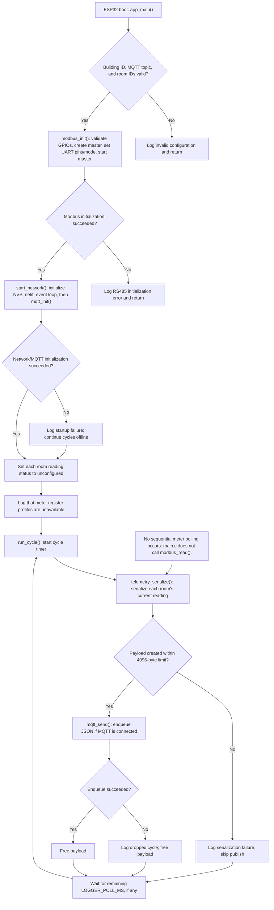

# Firmware execution flow

NVS is erased and initialized again only when `nvs_flash_init()` reports no free
pages or a new NVS version. An empty broker URI is an explicit offline mode and
does not select a substitute broker. ESP-MQTT and the Wi-Fi event handler manage
reconnection after their clients have started.
